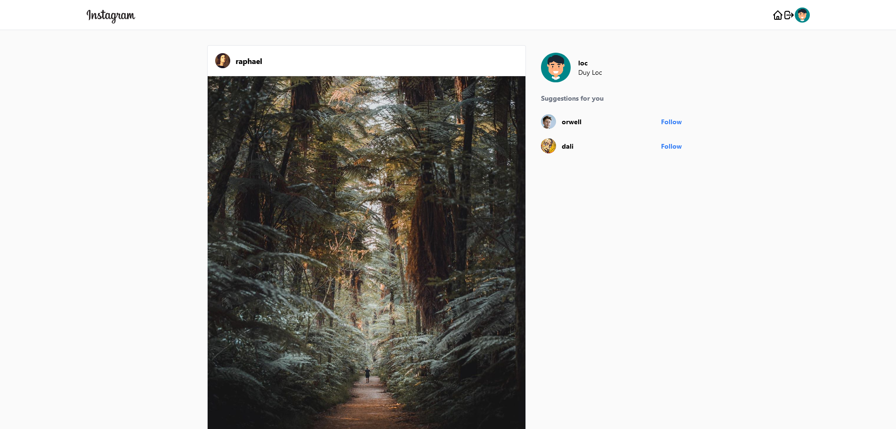
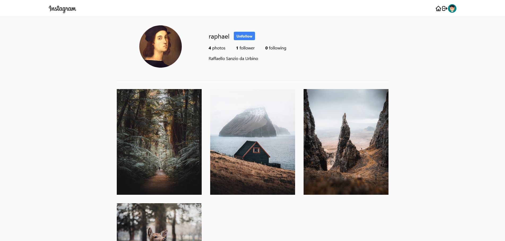

# Instagram Clone

This is a React course from [Scrimba](https://scrimba.com/learn/photoapp) by **Karl Hadwen**. Scrimba is a learning platform that help you improve your coding skills by building realistic projects with the world's best coding teachers.

## Table of contents

-   [Overview](#overview)
    -   [The course](#the-course)
    -   [Screenshot](#screenshot)
    -   [Links](#links)
-   [My process](#my-process)
    -   [Built with](#built-with)
    -   [What I learned](#what-i-learned)
    -   [Continued development](#continued-development)
    -   [Useful resources](#useful-resources)
-   [Author](#author)

## Overview

### The course

Why this course rock

-   Course by **Karl Hadwen** with 93 lessons in 9 hours.
-   Real world style project and architect.
-   This course will take full advantage of Scrimba's interactive code-learning experience.
-   You’ll learn to use **React**, **Firebase**, and **Tailwind**, and finish up with **fully-functioning, pro-looking Instagram clone** at the end of the course.

### Screenshot





### Links

-   Live Site URL: [Instagram Clone](https://instagram.duyloc.dev/)

## My process

### Built with

-   Flexbox
-   CSS Grid
-   [React](https://reactjs.org/) - JS library
-   [React router](https://reactrouter.com/) - React library
-   [Tailwindcss](https://tailwindcss.com/) - For styles
-   [Firebase](https://firebase.google.com/) - For database

### What I learned

-   Modem **React hook** with useState, useEffect, Lazy, Suspense.
-   How to create a login page, a sign-up page, a header, a timeline, a profile page, a dashboard page, a post, a sidebar, a not found page, and much more!
-   Styling by className in **Tailwindcss**.
-   **Skeleton** component whe loading.
-   React router to routing and protect route when user login or not.
-   Use noSQL **Firebase** authentication user and **Firestore** to store data.

```js
<div className="container col-span-2">
    {!photos ? (
        <Skeleton count={4} width={640} height={500} className="mb-5" />
    ) : photos && photos.length > 0 ? (
        photos.map((content) => <Post key={content.docId} content={content} />)
    ) : (
        <p className="text-center text-2xl">Follow people to see photos!</p>
    )}
</div>
```

```js
<Route path={ROUTES.LOGIN} component={Login} />
```

```js
const firebase = window.firebase.initializeApp(config);
const { FieldValue } = window.firebase.firestore;
```

### Continued development

-   Responsive web design.
-   Add hover state when hover photo in profile.
-   Add focus state when click on photo in profile.
-   Create, Delete photos.
-   Add default avatar when signUp.
-   Add dark theme.
-   Try to create from scratch with compound component and styled component.

### Useful resources

-   [Build an Instagram Clone in React](https://scrimba.com/learn/photoapp) - If you have nailed the basics of HTML, CSS, JavaScript, and React and feel ready to take on a massive, real-world-style project, Karl Hadwen’s Build an Instagram Clone course is perfect for you!
-   [Cloud Firestore docs](https://firebase.google.com/docs/firestore) - This helped me for storing data, i learn a lot of how to add, query data in NoSQL. I'd recommend it to anyone learning this concept. I really liked this pattern and will use it going forward.
-   [TaiwindCss docs](https://tailwindcss.com/docs) - This helped me for styling the whole app, i alway have an open tab to searching className, with this you don't need to write css but in my style i like the pure css more.
-   [Scrimba community](https://discord.gg/WfcdySxt) - Join Scrimba community and meet fellow students and ask for help and reviews of your code.

## Author

-   Website - [DuyLoc](https://www.duyloc.dev)
-   LinkedIn - [Loc Pham](https://www.linkedin.com/in/loc-pham-25a913151/)
-   Facebook - [fb.com/locpnd](https://www.facebook.com/locpnd/)
